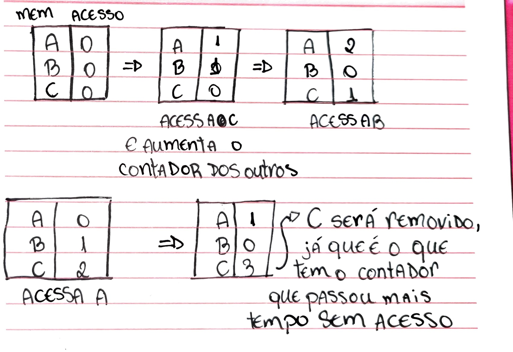
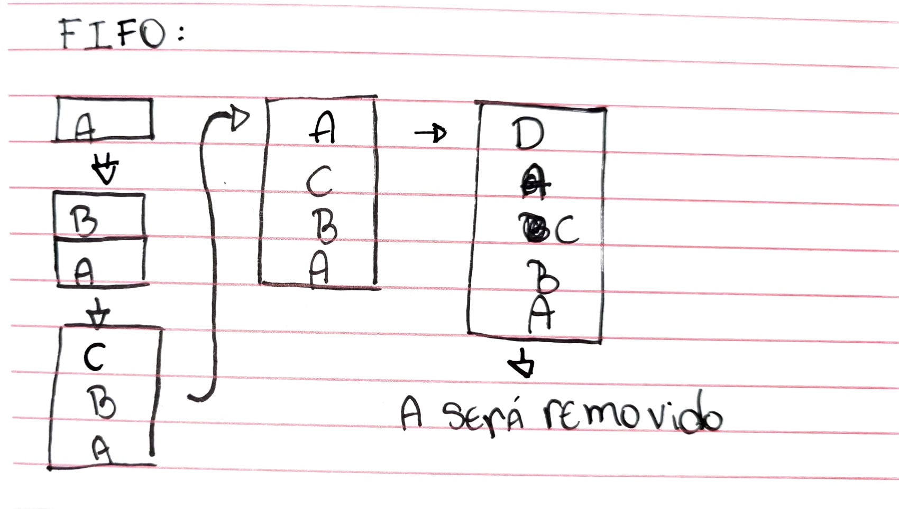
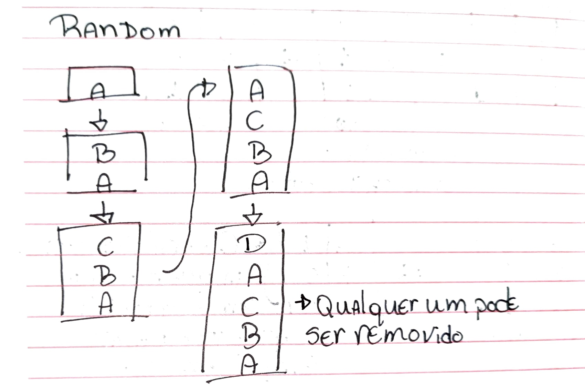
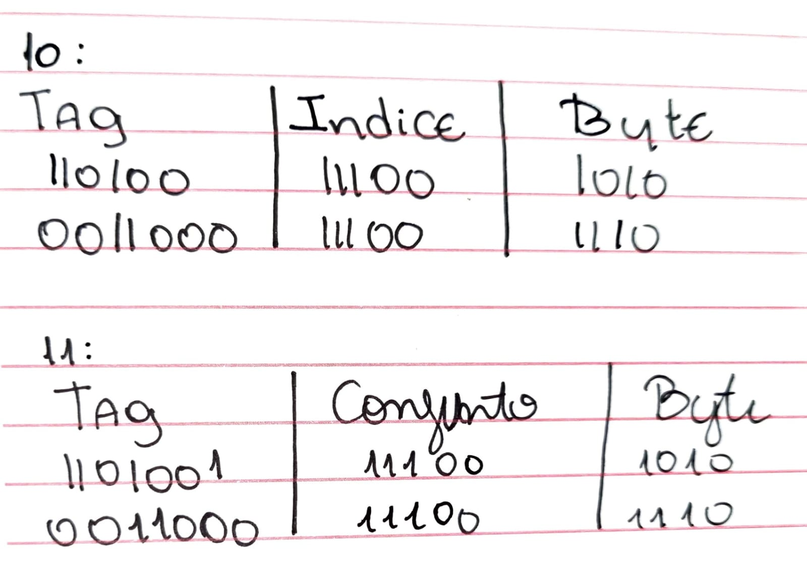
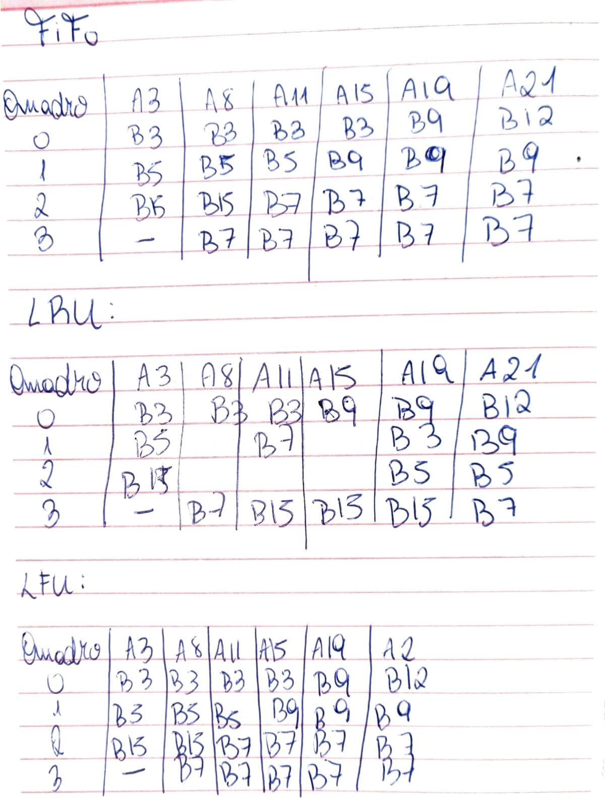

## Lista de Exercícios Org.

**1. Explique os conceitos de localidade espacial e localidade temporal. Como estes conceitos foram utilizados na implementação das memórias cache?**

**Localidade Temporal** - Considerando um acesso à uma palavra ne memória que foi recentemente acessado que pode ser acessado novamente em breve.

**Localidade Espacial** - Se uma palavra foi acessada na memória e se espera de que em breve será acessado o endereço seguinte.

São utilizados como métodos nos algoritmos de substituição da memória cache. São métodos utilizados na decisão de qual informação será mantida e qual será substituída para liberar espaço.

Por exemplo:
- **Least Recently Used (LRU)**: Verifica o bloco de memória que foi acessado há mais tempo e assume que ele é o menos provável de ser usado novamente. Utiliza o conceito de localidade temporal.

- **Algoritmos de Caminho**: Removem blocos que estão em um caminho de acesso menos provável de ser usado novamente, considerando o padrão de acesso aos blocos vizinhos. Utiliza o conceito de localidade espacial.

**Mario_Monteiro_-_Organizacao_de_computadores_5ed:**
Se um programa acessa uma palavra da memória, há uma boa probabilidade de que ele em breve acesse a mesma palavra novamente. Este é o princípio da localidade temporal. Se ele acessa uma palavra da memória, há uma boa probabilidade de que o acesso seguinte seja uma palavra subsequente ou de endereço adjacente àquela palavra que ele acabou de acessar. Nesse caso, trata-se da modalidade localidade espacial.

**2. Descreva detalhadamente cada uma das ações que ocorrem durante o acesso de leitura da memória considerando a existência de uma memória cache que utiliza mapeamento associativo?**

Mario_Monteiro_-_Organizacao_de_computadores_5ed:
1) O processador inicia o acesso colocando o endereço no BE(Barramento de Endereços ou Bus de Endereços), o qual é interceptado pelo sistema de controle da cache.

2) O valor do campo conjunto do endereço é transferido para o decodificador, cuja saída aponta para o conjunto formado por duas linhas da cache . Trata-se de procedimento exatamente igual ao do mapeamento direto, sendo que, neste caso, cada bloco está associado diretamente a um conjunto e não a uma linha.

3) Em seguida, o controle da cache irá localizar qual das linhas se deseja, comparando o valor existente no campo tag (3 bits) com o valor existente na coluna tag de cada uma das duas linhas do conjunto, exatamente como no método associativo completo.

4) Caso haja acerto (hit), o endereço do byte (bit menos significativo) é acionado para se efetuar a transferência para o processador do respectivo valor pelo barramento de dados; caso haja falta, o elemento de acesso à MP é acionado para se efetuar a localização do bloco; primeiramente, é definido o conjunto para onde ele será transferido (previamente definido como no mapeamento direto) e, segundo a política estabelecida de substituição de linha (item 5.4.2), escolhe-se qual linha do conjunto será usada, como no mapeamento associativo completo.

**3. Supondo um processador com barramento de endereços de 24 bits, qual a quantidade de células de memória endereçáveis por este processador?**

Um processador com um barramento de endereços de 24 bits pode endereçar até $2^{24}$ células de memória. Isso porque cada bit no barramento de endereços pode assumir dois valores (0 ou 1), e com 24 bits, podemos representar $2^{24}$ endereços únicos.

Assim: $2^{24}$ = 16.777.216

Portanto, um processador com um barramento de endereços de 24 bits pode endereçar até 16.777.216 células de memória.

**4. Qual a política de substituição de dados implementada no mapeamento direto?**

Não há uma política de substituição como LRU, LFU ou FIFO, isso é devido a cada bloco ter uma linha específica para qual foi mapeado na memória principal, então a posição dos blocos são fixas.

Se um novo bloco de dados precisa ser carregado e o bloco correspondente à linha da cache já está ocupado, o bloco existente é automaticamente substituído pelo novo bloco. A linha da cache onde um bloco de memória será armazenado é determinada pelo índice do bloco de memória. Esse índice é calculado a partir dos bits do endereço de memória.

**5. Suponha um sistema computacional com um espaço de endereçamento de 64K células, possuindo cada uma um endereço de 16 bits (216 = 64K). A cache associada a este sistema possui um tamanho de 4096 bytes (ou 4 Kbytes), divididos em 512 quadros (ou linhas), com 8 bytes de dados cada quadro. Pergunta-se:**

Espaço de endereçamento: 64K células (65536 células)  
Tamanho da cache: 4096 bytes (4 Kbytes)  
Número de quadros na cache: 512  
Tamanho de cada quadro: 8 bytes  

**a) Qual é o tamanho de cada bloco da memória principal?**

**Total de bytes na memória principal:**

Como cada célula tem 16 bits (2 bytes), o total de bytes na memória principal é:  

65536 células * 2 bytes/célula = 131072 bytes.  

**Número de blocos na memória principal:**

A cache tem 512 quadros, e cada quadro armazena um bloco da memória principal.  
Portanto, a memória principal também é dividida em 512 blocos.  

**Tamanho de cada bloco:**

Dividimos o tamanho total da memória principal pelo número de blocos:

131072 bytes / 512 blocos = 256 bytes/bloco.  

**b) Qual é a proporção de armazenamento entre a memória principal (MP) e a memória cache?**

MP = 131072  
Cache = 4096

MP / Cache  
131072 / 4096 = 32

**c) Considerando a implementação da política de mapeamento direto, como ficaria a divisão do endereço na sua implementação?**

Cada endereço tem 16 bits  
Tag => 16 bits - 9 = 7bits
Linha => 512 linhas = 2^9 => 9 bits para identificar a linha  
Byte => 3bits(para endereçar os 8bytes do bloco)

**d) Considerando a implementação da política de mapeamento associativo, como ficaria a divisão do endereço na sua implementação?**

tag => 13bits (16 - 3)
Byte => 3bits

**e) Qual o overhead percentual de cada uma das políticas de mapeamento?**

**Mapeamento Direto:**

Cada linha da cache precisa armazenar uma tag de 7 bits e um bit de validade.  
Overhead por linha: 8 bits  
Overhead total: 512 linhas * 8 bits/linha = 4096 bits = 512 bytes  
Overhead percentual: (512 bytes / 4096 bytes) * 100% = 12.5%  

**Mapeamento Associativo:**

Cada linha da cache precisa armazenar uma tag de 13 bits e um bit de validade.  
Overhead por linha: 14 bits  
Overhead total: 512 linhas * 14 bits/linha = 7168 bits = 896 bytes  
Overhead percentual: (896 bytes / 4096 bytes) * 100% = 21.875%  

**6. Quais as diferenças e as implicações nas políticas de escrita da memória cache: escrita em ambas e escrita no retorno?**

### Escrita em Ambas (Write-Through)
**Funcionamento:**
Quando uma operação de escrita é realizada na cache, os dados são imediatamente escritos na cache e também na memória principal, isso mantém a memória principal sempre atualizada com os dados mais recentes.

**Vantagens**
Simplicidade de implementação, pois não é necessário manter mecanismos complexos de coerência de dados.
Menor risco de inconsistência entre a cache e a memória principal, pois os dados na memória principal são sempre atualizados imediatamente.

**Desvantagens**
Pode ser mais lenta, já que cada operação de escrita envolve duas ações: escrever na cache e na memória principal.
Maior consumo de largura de banda no barramento, pois cada escrita gera tráfego adicional para a memória principal.

### Escrita no Retorno (Write-Back)
**Funcionamento:**
- Quando uma operação de escrita é realizada na cache, os dados são escritos apenas na cache.
- O bloco de dados na cache é marcado como "sujo" (dirty) para indicar que ele foi modificado.
- Os dados são escritos na memória principal apenas quando o bloco sujo é removido (substituído) da cache.

**Vantagens**
Melhor desempenho, já que as escritas são realizadas apenas na cache, reduzindo o número de acessos à memória principal.
Menor tráfego no barramento, pois várias escritas consecutivas podem ser combinadas antes de uma única operação de escrita na memória principal.

**Desvantagens**
Maior complexidade na implementação, pois é necessário rastrear quais blocos de cache estão sujos e garantir que os dados sejam escritos na memória principal antes de serem substituídos.
Potencial para inconsistências temporárias, pois a memória principal pode não refletir imediatamente os dados mais recentes.
Necessidade de mecanismos adicionais para manter a coerência de dados em sistemas multiprocessados.

**7. Cite políticas de substituição que podem ser implementadas em um sistema que utiliza memória cache. Explique cada uma delas e apresente um exemplo numérico que diferencie-as.**

**LRU (Least Recently Used)**: Remove o bloco que foi menos frequentemente acessado, assumindo que é o menos importante. É considerada a forma mais justa denre as políticas de substituição.

**LFU (Least Frequently Used)**: Remove o bloco que foi menos frequentemente acessado, assumindo que é o menos importante.

Considere a mesma cache e sequência de acessos: A B C A D. Ao acessar D, o bloco C será removido, pois foi acessado apenas uma vez, enquanto A foi acessado duas vezes.

**First-In, First-Out (FIFO):** Remove o bloco que está na cache há mais tempo, independentemente de quando foi acessado pela última vez. Não é considerada uma política de substituição justa.

**Random**: Qualquer bloco pode ser removido.

**8. Elabore um sistema de memória cache com mapeamento direto para um sistema que possua um processador com capacidade de endereçamento de 64 MB e uma memória cache de 128 KB. Calcule a quantidade de quadros e o tamanho dos mesmos e apresente a divisão do endereço do ponto de vista da memória cache e do ponto de vista da memória principal. Considere que cada linha armazena 512 bytes e que é utilizado mapeamento associativo por conjuntos com 8 conjuntos.**

Tamanho da cache: 128 KB = 128 * 1024 bytes = 131072 bytes  
Tamanho de cada linha: 512 bytes  
Número de linhas da cache: 131072 bytes / 512 bytes/linha = 256 linhas  
Número de conjuntos: 8  
Linhas por conjunto: 256 linhas / 8 conjuntos = 32 linhas/conjunto  
Tamanho do bloco: Como cada linha da cache armazena um bloco da memória principal, o tamanho do bloco é igual ao tamanho da linha, ou seja, 512 bytes.  
Número de blocos na memória principal: 64 MB / 512 bytes/bloco = 131072 blocos

**Divisão do Endereço:**

**Endereço de memória principal (16 bits):**
Tag: 7 bits (16 bits - 9 bits)  
Conjunto: 5 bits (log₂ 8 conjuntos = 5 bits)  
Byte: 4 bits (log₂ 512 bytes = 9 bits; 9 bits - 5 bits = 4 bits)  

**Endereço de memória cache:**
Tag: 7 bits  
Linha: 5 bits (log₂ 32 linhas/conjunto = 5 bits)  
Byte: 4 bits  

**9. Apresente um exemplo com uma MP de pelo menos 256 bytes que mostre que o mapeamento associativo e o mapeamento direto podem ser considerados casos especiais do mapeamento associativo por conjuntos.**

**Número de conjuntos:** 4 (cache de 32 bytes / 8 bytes por linha = 4 linhas; 4 linhas / 1 linha por conjunto = 4 conjuntos)  

**Divisão do endereço:**  
Tag: 6 bits (8 bits de endereço - 2 bits para linha)  
Conjunto: 2 bits (log₂ 4 conjuntos = 2 bits)  
Byte: 0 bits (bloco e linha têm o mesmo tamanho)  

**10. Considerado o exercício 8, e a utilização do mapeamento direto, é possível que os endereços 1101000111001010 e 0011000111001110 estejam presentes simultaneamente na memória cache? Justifique.**

Não, os endereços 1101000111001010 e 0011000111001110 não podem estar presentes simultaneamente na memória cache se utilizarmos mapeamento direto. Considerando que no mapeamento direto, cada bloco da memória principal é mapeado para uma única linha da cache, determinada pelos bits de índice do endereço.

**Ver imagem**

Devido ao valor de indice ser o mesmo para ambos, não é possível considerando que eles seriam mapeados para a mesma linha. Assim, dentro do mapeamento direto, eles não existiriam.

**11. Considerado o exercício 8, e a utilização do mapeamento direto, é possível endereços 1101001111001010 e 0011000111001110 estejam presentes simultaneamente na memória cache? Justifique.**

Não, se usarmos mapeamento direto, cada bloco da memória principal é mapeado para uma única linha da cache, determinada pelos bits de índice do endereço.

**Ver imagem**

Devido ao valor de conjunto ser o mesmo para ambos, não é possível considerando que eles seriam mapeados para a mesma linha. Assim, dentro do mapeamento direto, eles não existiriam.

**12. Considerando um sistema de memória qualquer, alguma das três políticas de mapeamento da memória apresentará um overhead percentual relativo ao rótulo maior que as demais. Sim/Não? Porque?**

No mapeamento associativo, cada bloco da memória principal pode ser colocado em qualquer bloco da memória cache. Para isso, é necessário que cada bloco da cache armazene, além dos dados, uma tag (rótulo) que identifica qual bloco da memória principal está armazenado ali. Como qualquer bloco pode estar em qualquer lugar, a tag precisa ser grande o suficiente para identificar unicamente qualquer bloco da memória principal.

No mapeamento direto, cada bloco da memória principal só pode ser colocado em um bloco específico da cache. Isso significa que a tag precisa apenas identificar de qual conjunto de blocos da memória principal o bloco armazenado na cache pertence, exigindo uma tag menor.

No mapeamento associativo por conjuntos, a tag precisa identificar de qual conjunto de blocos da memória principal o bloco armazenado na cache pertence, mas também precisa identificar qual bloco específico dentro desse conjunto está armazenado. Isso resulta em uma tag de tamanho intermediário entre o mapeamento direto e o associativo.

**13. Supondo uma cache com 4K quadros; cada quadro com tamanho de 256 bytes. A MP possui endereços de 32 bits. Calcule o número de bits do rótulo considerando os esquemas de mapeamento direto e mapeamento associativo.**

**Mapeamento Direto:**  
Quadros: 4K = 4 * 1024 = 4096 quadros  
Bits para índice: log₂(4096) = 12 bits  
Bits para byte: log₂(256) = 8 bits  
Bits para tag: 32 bits (endereço) - 12 bits (índice) - 8 bits (byte) = **12 bits**  

**Mapeamento Associativo:**  
Bits para byte: log₂(256) = 8 bits  
Bits para tag: 32 bits (endereço) - 8 bits (byte) = **24 bits**  

**14. Supondo uma memória cachê composta de 4 quadros utilizando uma política de mapeamento associativo. Tendo em vista a seqüência de acessos a MP mostrada abaixo, onde a primeira linha mostra o número do acesso e a segunda linha mostra o bloco da MP acessado. Responda as questões apresentadas.**

a) Mostre qual bloco encontra-se nos quadros da Memória Cache depois da ocorrência dos acessos número 3, 8, 11, 15, 19 e 21 considerando as políticas de substituição de dados:

b) Qual a taxa de acertos (hits) e faltas (faults) desta sequência de acessos?

Acertos (Hits): 9
Faltas (Faults): 12
Taxa de Acertos: (9 / 21) * 100% = 42.86%
Taxa de Faltas: (12 / 21) * 100% = 57.14%

c) Qual o próximo quadro que terá seu bloco substituído (ou em outras palavras, qual o próximo bloco a ser substituído na cachê?) depois dos acessos 20 e 21?
**FIFO:** Quadro 0 (B3 seria substituído)  
**LRU:** Quadro 3 (B7 seria substituído)  
**LFU:** Quadro 0 ou Quadro 2 (B3 ou B15 seriam substituídos, pois ambos têm a mesma frequência de acesso)  

**15. Com base na figura abaixo que descreve um sistema MP/Cache e sabendo que se utiliza mapeamento direto, responda, justificando todas as questões:**

**a) Qual a divisão do endereço deste sistema?**

Tag (rótulo): 8 bits (bits mais significativos do endereço)
Linha: 5 bits (bits intermediários do endereço)
Byte: 3 bits (bits menos significativos do endereço)

**b) A qual linha da memória cache está destinado o endereço da MP 101110110?**
Para determinar a linha da cache, extraímos os 5 bits intermediários do endereço 101110110, que são 11011.
Convertendo para decimal = 27.
O endereço 101110110 da MP está destinado à linha Q27 da cache.

**c) Qual o endereço de memória que se encontra na 1ª célula da linha Q30 M. cache?**

A primeira célula de uma linha na cache sempre armazena o byte 0 do bloco correspondente da MP.  
Para determinar o endereço completo, precisamos conhecer a tag associada à linha Q30.  
A figura mostra que a tag da linha Q30 é 00. Assim, o endereço completo da primeira célula da linha Q30 é 0011110000000000.  

**d) Qual a quantidade de blocos de memória que o sistema possui? Justifique.**

A quantidade de blocos na MP é igual à quantidade de linhas na cache, pois cada bloco é mapeado para uma única linha.  
A figura mostra 32 linhas na cache (Q0 a Q31), portanto o sistema possui 32 blocos de memória.  

**e) Qual o tamanho da memória cache e da memória principal em bytes? Justifique.**
**Memória Cache:**

Cada linha armazena 4 células de 1 byte cada, totalizando 4 bytes por linha.
Tamanho total da cache = 32 linhas * 4 bytes/linha = 128 bytes.

**Memória Principal:**

O sistema possui 65536 células de memória (2^16).
Cada célula tem 1 byte.
Tamanho da MP = 65536 células * 1 byte/célula = 65536 bytes.

**16. Uma memória principal tipo DDR funciona em um barramento rodando a 200MHZ com ciclos de wait-states 4-1-1-1. Pergunta-se:**

**a) Qual a largura de banda máxima teórica do sistema?**  
largura de banda teórica = 200MHz * 2 * 64bits = 25600Mbits/s

**b) Qual a largura de banda efetiva do mesmo?**  
Largura de banda efetiva = 3200 MB/s * (1 / 7) ~= 457.14 MB/s

**17. Apresente e explique as 4 categorias de melhora da performance da cache existentes de acordo com Patterson & Hannessy.**

**Redução da taxa de falhas (miss rate):**
Tamanho do bloco (block size): Blocos maiores podem explorar a localidade espacial, trazendo mais dados úteis de uma vez. No entanto, blocos muito grandes podem desperdiçar espaço se os dados extras não forem usados e aumentam o tempo de transferência em caso de falha.
Tamanho da cache: Aumentar o tamanho da cache permite armazenar mais dados, reduzindo a probabilidade de falhas. Porém, caches maiores são mais caras e podem ter tempos de acesso mais longos.

Associatividade: Caches totalmente associativas oferecem a maior flexibilidade de posicionamento de blocos, reduzindo conflitos e falhas. No entanto, são complexas e lentas. Caches diretas (direct-mapped) são mais simples e rápidas, mas sofrem mais com conflitos. Caches associativas por conjunto (set-associative) oferecem um equilíbrio entre flexibilidade e desempenho.

Algoritmo de substituição: O algoritmo de substituição escolhe qual bloco remover da cache em caso de falha. Algoritmos como LRU (Least Recently Used) e LFU (Least Frequently Used) tentam prever quais blocos serão menos usados no futuro, minimizando falhas.

**Redução da penalidade de falha (miss penalty):**
Cache multinivel: Adicionar níveis extras de cache (L2, L3, etc.) com tempos de acesso maiores, mas ainda menores que a memória principal, pode reduzir a penalidade de falhas no nível L1.

Escrita buffer (write buffer): Em caches com write-through, um write buffer permite que a CPU continue executando enquanto os dados são gravados na memória principal em segundo plano.

Pré-busca (prefetch): A pré-busca tenta prever quais blocos serão necessários em breve e os traz para a cache antes que sejam solicitados, evitando falhas.

**Redução do tempo de acerto (hit time):**
Cache de menor tamanho: Caches menores geralmente têm tempos de acesso mais rápidos devido a caminhos de dados mais curtos e menor complexidade de hardware.
Associatividade direta (direct-mapped): Caches diretas são mais simples e, portanto, mais rápidas que caches associativas.
Otimizações de hardware: Técnicas como multiplexadores mais rápidos, decodificadores de endereço otimizados e layouts de cache eficientes podem reduzir o tempo de acerto.
Redução do consumo de energia da cache:
Desligamento de partes da cache: Em sistemas com múltiplos núcleos ou caches particionadas, partes não utilizadas da cache podem ser desligadas para economizar energia.
Gerenciamento dinâmico de energia: A voltagem e a frequência da cache podem ser ajustadas dinamicamente com base na demanda, reduzindo o consumo de energia em períodos de baixa atividade.
Way prediction: Em caches associativas por conjunto, a way prediction tenta prever qual conjunto (way) contém o bloco desejado, permitindo que apenas esse conjunto seja acessado, economizando energia.

**18. O que é memória virtual? Para que é usada? Quem dá suporte? Quem gerencia? Quais as técnicas de implementação?**

A memória virtual é uma técnica que permite que um computador utilize mais memória do que a fisicamente disponível (RAM). Ela cria a ilusão de um espaço de memória muito maior do que a RAM real, permitindo que programas maiores sejam executados e que mais programas sejam abertos simultaneamente.

**Para que é usada?**

A memória virtual é usada para:

**Expandir a capacidade de memória:** Permite executar programas que exigem mais memória do que a disponível na RAM.
Gerenciar a memória de forma eficiente: Permite que o sistema operacional aloque e gerencie a memória de forma mais flexível e eficiente.

**Isolar processos:** Cada processo tem seu próprio espaço de endereçamento virtual, o que evita que um processo interfira na memória de outro.

**Simplificar o carregamento de programas:** Permite que os programas sejam carregados em qualquer lugar da memória física, sem a necessidade de realocação.
Quem dá suporte?

O suporte à memória virtual é fornecido pelo hardware do computador (MMU - Memory Management Unit) e pelo sistema operacional.

**Quem gerencia?**

A memória virtual é gerenciada pelo sistema operacional. Ele é responsável por:

**Mapear páginas virtuais para páginas físicas:** Aloca espaço na RAM para as páginas virtuais que estão sendo usadas e as mapeia para endereços físicos.

**Transferir páginas entre a RAM e o disco:** Quando a RAM está cheia, o sistema operacional transfere algumas páginas para o disco (swap) para liberar espaço.

**Resolver falhas de página:** Quando um programa tenta acessar uma página que não está na RAM, ocorre uma falha de página. O sistema operacional então carrega a página do disco para a RAM.

Técnicas de implementação:

Existem duas técnicas principais de implementação da memória virtual:

**Paginação:** A memória virtual é dividida em blocos de tamanho fixo chamados páginas. As páginas são armazenadas no disco e carregadas na RAM quando necessário.

**Segmentação**: A memória virtual é dividida em segmentos de tamanho variável. Cada segmento corresponde a uma unidade lógica do programa, como código, dados ou pilha.

**19. Quais são os recursos que devem ser implementados no processador para dar suporte a Memória Virtual?**

**Unidade de Gerenciamento de Memória (MMU):** A MMU é um componente de hardware responsável por traduzir endereços virtuais em endereços físicos. Ela contém tabelas de mapeamento que associam cada página virtual a uma página física na memória RAM ou no disco.

**Registradores de controle:** O processador precisa de registradores específicos para armazenar informações sobre a memória virtual, como:

**Registrador de base da tabela de páginas:** Armazena o endereço inicial da tabela de páginas na memória física.
Registrador de tamanho da página: Define o tamanho de cada página virtual.

**Mecanismos de proteção:** A MMU implementa mecanismos de proteção para garantir que cada processo acesse apenas seu próprio espaço de endereçamento virtual e não interfira na memória de outros processos. Isso inclui:

**Bits de proteção:** Bits associados a cada entrada da tabela de páginas que definem os direitos de acesso (leitura, escrita, execução) para aquela página.
Níveis de privilégio: O processador opera em diferentes níveis de privilégio, e a MMU garante que apenas processos com privilégios suficientes possam acessar determinadas áreas da memória.

**Tratamento de falhas de página:** Quando um processo tenta acessar uma página virtual que não está presente na memória RAM, ocorre uma falha de página. O processador precisa ter um mecanismo para interromper a execução do processo, transferir o controle para o sistema operacional e, em seguida, retomar a execução do processo após a página ser carregada na memória.

**Suporte para paginação e/ou segmentação:** O processador deve ser capaz de trabalhar com as técnicas de paginação e/ou segmentação, que são as formas mais comuns de implementar a memória virtual.

**20. Explique como se dá o processo de tradução do endereço lógico em físico em um sistema que implementa memória virtual usando paginação.**

**Tradução de endereço**: Também chamada de mapeamento de
endereço. O processo pelo qual um endereço virtual é mapeado a
um endereço usado para acessar a memória.

O processador gera endereços virtuais enquanto a memória é acessada usando endereços físicos.

Tanto a memória virtual quanto a memória física são desmembradas em páginas, de modo que uma página virtual é realmente mapeada em uma página física.

Naturalmente, também é possível que uma página virtual esteja ausente da memória principal e não seja mapeada para um endereço físico, residindo no disco em vez disso. As páginas físicas
podem ser compartilhadas fazendo dois endereços virtuais apontarem para o mesmo endereço físico. Essa capacidade
é usada para permitir que dois programas diferentes compartilhem dados ou código.

**21. O que é e, como funciona a TLB? Como se dá o processo de tradução de endereços lógicos em físicos considerando a existência da mesma?**

TLB (translation-lookaside buffer) é uma cache especial de tradução de endereços, também pode ser mais correto chamá-la de cache de tradução.

A TLB corresponde àquele pequeno pedaço de papel que normalmente usamos para registrar o local de um conjunto de livros que consultamos no catálogo; em vez de pesquisar continuamente o catálogo inteiro, registramos o local de vários livros e usamos o pedaço de papel como uma cache da biblioteca.

Cada entrada de tag na TLB contém uma parte do número de página virtual, e cada entrada de dados da TLB contém um número de página física.

Como não iremos mais acessar a tabela de páginas a cada referência, em vez disso acessaremos a TLB, que precisará incluir outros bits de status, como o bit de modificação e o bit de referência.

**Funcionamento da TLB:**

**Consulta:** Quando o processador emite um endereço virtual, a MMU primeiro verifica se a tradução correspondente está presente na TLB. Essa consulta é muito rápida, pois a TLB é uma cache de alta velocidade.

**Acerto (TLB Hit):** Se a tradução for encontrada na TLB (TLB Hit), a MMU obtém o endereço físico diretamente da TLB e o envia para a memória principal, sem a necessidade de acessar a tabela de páginas.

**Falha (TLB Miss):** Se a tradução não for encontrada na TLB (TLB Miss), a MMU precisa acessar a tabela de páginas na memória principal para obter a tradução. Em seguida, ela armazena a tradução na TLB para acessos futuros.

**Processo de tradução de endereços com TLB:**

**Endereço Lógico:** O processador emite um endereço lógico.
Consulta à TLB: A MMU verifica se a tradução está na TLB.

**TLB Hit:** Se estiver, a MMU obtém o endereço físico da TLB e o envia para a memória principal.

**TLB Miss:** Se não estiver, a MMU acessa a tabela de páginas na memória principal.

**Acesso à Tabela de Páginas:** A MMU usa o número da página virtual (VPN) do endereço lógico para indexar a tabela de páginas e obter o número do quadro da página física (PFN).
Verificação de Presença: A MMU verifica se a página está na memória RAM.

**Página na RAM:** A MMU concatena o PFN com o deslocamento (offset) do endereço lógico para formar o endereço físico e o envia para a memória principal.

**Página no Disco (Page Fault):** O sistema operacional é acionado para trazer a página do disco para a RAM. Após a página ser carregada, a tradução é armazenada na TLB e o processo de tradução é reiniciado.

**Armazenamento na TLB:** A MMU armazena a tradução na TLB para acessos futuros.