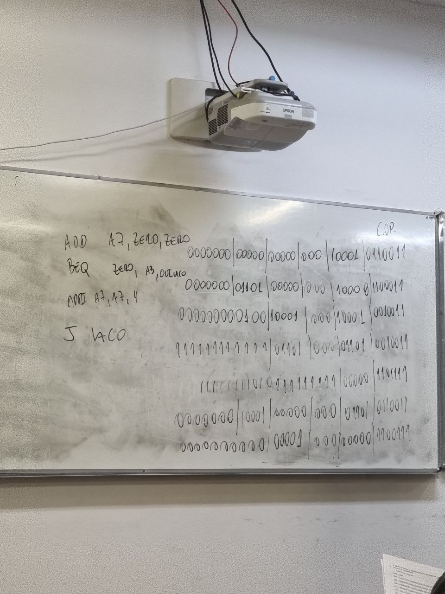
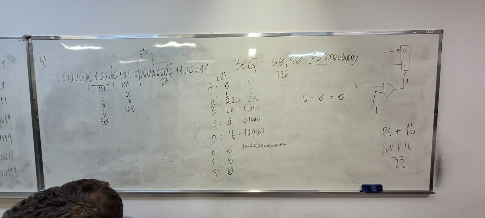

# Respostas Prova 1

1. Apresente e descreva detalhadamente as proposições de Von Neumann para a construção de computadores digitais

Von Neumann propôs uma arquitetura de computador que consiste em 5 partes

- Memória
- Unidade de Controle
- Unidade Aritmética e Lógica
- Unidade de Entrada e Saída
- Registradores

Essas partes compõem o que chamamos de **Unidade Central de Processamento** (CPU).

2. Utilizando o conjunto de instruções do RISC-V implemente a função diferenca que recebe em a0 o endereço de um vetor e em a1 o tamanho deste vetor. A função deve calcular e retornar em a0 a diferença entre o maior e o menor valor presente no vetor.

[Resposta](./questao2.asm)

Explicação do código:  
Defina um vetor e seu tamanho  
A área de .data é usada para declarar variáveis globais e constantes.

```assembly
.data
vetor:     .word 7, 3, -9, 11, 4, 5, -1, 0, 6, 4
tamanho:   .word 10
```

Inicialize os registradores

```assembly
main:
    la a0, vetor   # a0 <- &vetor
    lw a1, tamanho # a1 <- tamanho
```

Vamos inicializar o registrador s1 com 0 para armazenar o maior valor do vetor.

```assembly
    li s1, 0
```


E carregar o primeiro elemento do vetor em s0

```assembly
    lw s0, 0(a0)
```

Incializamos uma rótulo para o início do loop carregamos o valor da primeira posição em s2

```assembly
loop_start:
    lw s2, 0(a0)
```

Ainda dentro do rótulo do loop, verificamos que é a primeira iteração usando beqz(branch if equal to zero) e definimos um novo rótulo para esta primeira iteração

```
    beqz a1, first_iteration
```

Dentro do novo rótulo, first_iteration, usaremos mv(move) para mover o valor de s2 para s0 e s1, pois na primeira iteração, o maior e o menor valor do vetor são iguais.

Também definimos um novo rótulo para continuar o loop

```assembly
first_iteration:
    mv s0, s2   # menor = vetor[x]
    mv s1, s2   # maior = vetor[x]
    j continue_loop
```

No rótulo de continue_loop (Cuide onde ele será colocado, siga o arquivo da [questão 2](./questao2.asm)) adicionamos 4 ao endereço do vetor, isso porque **cada posição do vetor tem 4 bytes** e subtraímos 1 do tamanho do vetor.

Depois disso, se o tamanho do vetor ainda não for zero (bnez - branch if not equal to zero) voltamos para o início do loop, loop_start

```assembly
continue_loop:
    addi a0, a0, 4
    addi a1, a1, -1
    bnez a1, loop_start
```

Voltando à função de loop_start, vamos adicionar duas verificações, blt (branch if less than), que se o valor de s2 for menor que s0, atualizamos s0 com o valor de s2 e bgt (branch if greater than), que se o valor de s2 for maior que s1, atualizamos s1 com o valor de s2.

Ao final, voltamos para o rótulo continue_loop

```assembly
loop_start:
    lw s2, 0(a0)

    beqz a1, first_iteration

    blt s2, s0, update_menor
    bgt s2, s1, update_maior
    j continue_loop
```

Vamos criar os rótulos update_menor e update_maior para atualizar os valores de s0 e s1.

Em s0, sempre teremos o valor menor e em s1 sempre o valor maior.
Como temos em s2 o número atual do vetor

```assembly
update_menor:
    mv s0, s2
    j continue_loop

update_maior:
    mv s1, s2
```

## 3. (2.0) Considerando a equação abaixo e a arquitetura de armazenamento baseado em acumulador (também chamado de registrador de trabalho) faça o que se pede.

$$
S = (A^2 - (\frac{C}{A})) * (\frac{D+B}{2^C})
$$

a) Defina a sintaxe e a semântica das instruções;

sintática ; semântica
movwm op ; (op) <- w
movwm op ; w <- (op)
movwi op ; w <- op
mul op ; w <- w \* (op)
div op ; w <- w / (op)
add op ; w <- w + (op)
sub op ; w <- w - (op)
pow op ; w <- w ^ (op)
powi op ; w <- w ^ op

b) Apresente o programa que implementa a equação acima utilizando o conjunto de instruções apresentados no item anterior.
movwi 2 ; w <- 2
pot c ; w <- 2^c
movwm x ; x <- 2^c
movmw d ; w <- d
som b ; w <- d + b
div x ; w <- (d + b) / 2^c
movwm z ;
movmw a ; w <- a
poti 2 ; w <- a^2
movwm r ; r <- a^2
movmw c ; w <- c
div a ; w + (c/a)
movmw p ;
movmw r ;
sub p ;
mul z ;
movmw s ;

4. (2.0) Considerando o formato das instruções do processador RISC-V, qual o código de máquina (binário) deste programa?

Como encontrar os valores:

```assembly
add a7, zero, zero
````

| funct7 | rs2 | rs1 | funct3 | rd   | opcode  |
| ------ | --- | --- | ------ | ---- | ------- |
| 000000 | 000 | 000 | 000    | 1001 | 0110011 |

```assembly
beq zero, a3, out_laco
```

| funct7 | rs2 | funct3 | rs1 | funct3 | rd   | opcode  |
| ------ | --- | ------ | --- | ------ | ---- | ------- |
|        |     |        |     | 000    | 0000 | 1100011 |



add a7, zero, zero  
0000000 | 00000 | 00000 | 000 | 1001 | 0110011

beg zero, a3, out_laco  
0000000 | 01101 | 00000 | 000 | 10000 | 1100011

addi a7, a7, 4  
000000000100 | 10001 | 000 | 10001 | 0010011

j laco  
111111111111 | 01101 | 000 | 01101 | 0010011

11111111010111111111 | 00000 | 1101111

add a3, zero, a7  
0000000 | 10001 | 00000 | 000 | 01101 | 0110011

ret

## 5.


