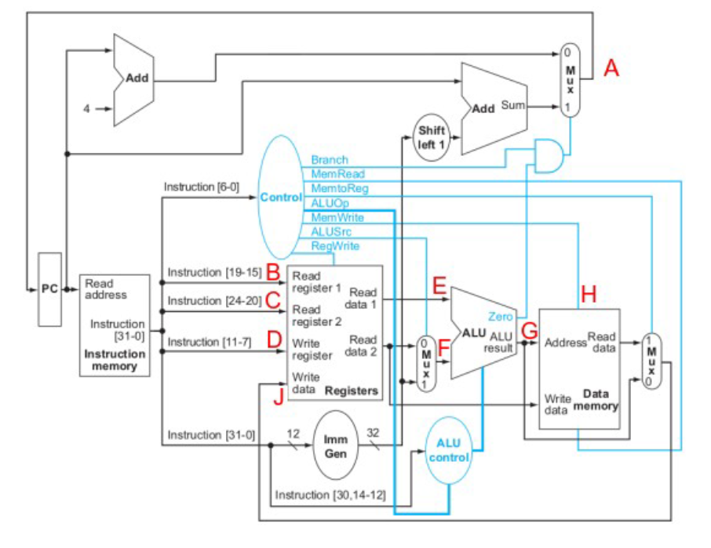

1. (1.0) Apresente e descreva as proposições de Von Neumann para a construção de computadores digitais.

2. (2.5) Utilizando o conjunto de instruções do RISC-V implemente a função qtd_comparacao que recebe em a0 o endereço inicial de um vetor de inteiros, em a1 o tamanho deste vetor e em a2 um numero inteiro. A função deve retornar em a0 a quantidade de  lementos do vetor cujo valor é menor que o número inteiro a2. 

**Valendo um ponto extra: retornar em a1 o índice do elemento com a maior diferença**

[Resposta](./resposta2.asm)


3. (2.0) Sabendo que A, B, C e S são endereços de memória e considerando o conjunto de instruções e o programa apresentado, faça o que se pede:

POP op; (op) topo ← topo-1  
PUSHI op ; topo op ← topo-1  
PUSH op; topo (op)← topo-1  
POW ; topo ← topo ^ topo-1  
ADD ; topo ← topo + topo-1  
SUB ; topo ← topo - topo-1  
MUL ; topo ← topo * topo-1  
DIV ; topo ← topo / topo-1  


| Linha | Programa |
|-------|----------|
|   1   | PUSHI 4  |
|   2   | PUSH C   |
|   3   | ADD      |
|   4   | PUSHI 10 |
|   5   | PUSH B   |
|   6   | SUB      |
|   7   | PUSHI 3  |
|   8   | PUSH A   |
|   9   | POW      |
|  10   | DIV      |
|  11   | POW      |
|  12   | POP S    |

a) Apresente o “valor” presente na pilha ao final da execução das linhas 6, 9 e 11. 

Linha 6:
| Pilha    |
|----------|
| 10 - B   |
| 4 + C    |

Linha 9:
| Pilha    |
|----------|
| A ^ 3    |
| 10 - B   |
| 4 + C    |

Linha 11:
| Pilha    |
|----------|
| ((10 - B) / A^3)^2   |

b) Apresente o “valor” presente no endereço de memória S ao final do programa.  

((10 - B) / A^3)^2

4. (2.0) Considere o formato das instruções do processador RISC-V, sabendo que a chamada da função ret_posicao foi realizada a partir do endereço de memória 820, e que a função está armazenada a partir do endereço de memória 600, responda, justificando as respostas?

```
ret_posicao:
    add a7, zero, zero
laco:
    beq zero, a3, out_laco
    addi a7, a7, 4
    addi a3, a3, -1
    j laco
out_laco:
    add a3, zero, a7
    ret
```

a) Qual o valor associado aos rótulos (labels) ret_posição, laco e out_laco?  

| Endereço | Linha do Código |
|----------|-----------------|
| 600      | ret_posicao:        |
| 604      | add a7, zero, zero |
| 608      | laco:              |
| 612      | beq zero, a3, out_laco |
| 616      | addi a7, a7, 4      |
| 620      | addi a3, a3, -1     |
| 624      | j laco           |
| 628      | out_laco:          |
| 632      | add a3, zero, a7  |
| 636      | ret             |

ret_posicao: 600
laco: 608
out_laco: 628

b) Qual o valor presente no campo “imm” da instrução BEQ? 

Endereço da próxima instrução (addi a7, a7, 4): 616
Endereço do destino (out_laco): 628
Deslocamento: 628 - 616 = 12 bytes
Deslocamento em palavras: 12 bytes / 4 bytes por palavra = 3 palavras
Valor no campo "imm": 3

c) Qual o valor presente no campo “imm” da instrução J?  

Endereço da instrução j: 624
Endereço do destino (laco): 608
Deslocamento: 608 - 624 = -16 bytes
Deslocamento em palavras: -16 bytes / 4 bytes por palavra = -4 palavras
Valor no campo "imm": -4

d) Qual o valor que será colocado no PC quando a instrução RET for executada  

A instrução ret é um pseudo-operador que equivale a jalr zero, ra, 0. Ela restaura o valor do registrador ra (link register), que armazena o endereço de retorno da chamada da função, para o PC (program counter).

Como a chamada da função ocorreu no endereço 820, o valor armazenado em ra será 824 (endereço da próxima instrução após a chamada). Portanto, a instrução ret colocará o valor 824 no PC, retornando a execução para o ponto após a chamada da função.

5. (2.5) Considere os seguintes valores presentes na memória de programa e no banco de registradores:
Banco de Registradores:

End – Instrução Banco de registradores   
200 – ADDI t1, t0, 7   
204 – ADD t2, s0, t1  
208 – SW t2, 0 (sp)   
212 – BEQ t2, zero, FIM   

| Posição | PC atual | Próximo PC |
| :-----: | :-----: | :-----: |
| A       |         |         |
| B       |         |         |
| C       |         |         |
| D       |         |         |
| E       |         |         |
| F       |         |         |
| G       |         |         |
| H       |         |         |
| J       |         |         |

| x0    | zero  | 0x00000000 |
| :---: | :---: | :--------: |
| x1    | ra    | 0x00000000 |
| x2    | sp    | 0x7ffffff0 |
| x3    | gp    | 0x10000000 |
| x4    | tp    | 0x00000000 |
| x5    | t0    | 0x00000000 |
| x6    | t1    | 0x00000007 |
| x7    | t2    | 0x00000000 |
| x8    | s0    | 0x00000013 |
| x9    | s1    | 0x00000000 |
| x10   | a0    | 0x00000010 |
| x11   | a1    | 0x00000000 |
| x12   | a2    | 0x00000000 |
| x13   | a3    | 0x00000000 |
| x14   | a4    | 0x00000000 |
| x15   | a5    | 0x00000000 |
| x16   | a6    | 0x00000000 |
| x17   | a7    | 0x00000000 |
| x18   | s2    | 0x00000000 |

