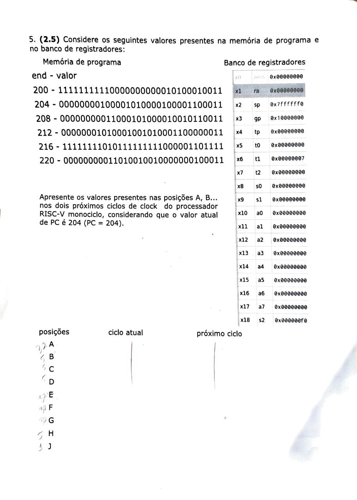

# Prova NP1

1. (1.0) Apresente e descreva detalhadamente as proposições de Von Neumann para a construção de computadores digitais

2. (2.5) Utilizando o conjunto de instruções do RISC-V implemente a função diferenca que recebe em a0 o endereço de um vetor e em a1 o tamanho deste vetor. A função deve calcular e retornar em a0 a diferença entre o maior e o menor valor presente no vetor.

3. (2.0) Considerando a equação abaixo e a arquitetura de armazenamento baseado em acumulador (também chamado de registrador de trabalho) faça o que se pede.
   $$
   S = (A^2 - (\frac{C}{A})) * (\frac{D+B}{2^C})
   $$

a) Defina a sintaxe e a semântica das instruções;  
b) Apresente o programa que implementa a equação acima utilizando o conjunto de instruções apresentados no item anterior.

4. (2.0) Considerando o formato das instruções do processador RISC-V, qual o código de máquina (binário) deste programa?

```assembly
ret_pos:
  add a7, zero, zero

laco:
  beg zero, a3, out_laco.
  addi a7, a7, 4
  addi a3, a3, -1
  j laco

out_laco:
  add a3, zero, a7
  ret
```

5. (2.5) Considere os seguintes valores presentes na memória de programa e no banco de registradores:


