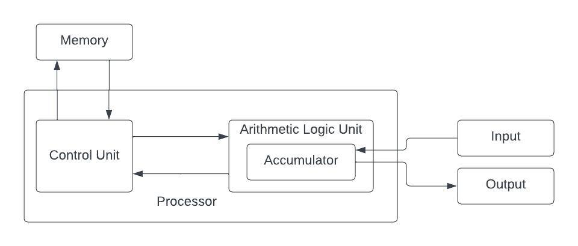

# Von Neumann Architecture

A arquitetura de Von Neumann é uma arquitetura de computador que foi proposta por John Von Neumann em 1945.

[Organização estruturada de Computadores, página 15](../slides/01_Organização%20estruturada%20de%20computadores%20by%20Andrew%20S.%20Tanenbaum.pdf)

Cinco partes básicas:

- Memória
- Unidade de lógica e aritmética
- Unidade de controle
- Equipamento de entrada e saída

A máquina de von Neumann tinha cinco partes básicas: a memória, a unidade de lógica e aritmética, a unidade de controle e o equipamento de entrada e saída. A memória consistia em 4.096 palavras, uma palavra contendo 40 bits, cada bit sendo 0 ou 1.

Cada palavra continha ou duas instruções de 20 bits ou um inteiro de 40 bits com sinal. As instruções tinham 8 bits dedicados a identificar o tipo da instrução e 12 bits para especificar uma das 4.096 palavras de memória. Juntas, a unidade de lógica e aritmética e a unidade de controle formavam o “cérebro” do computador. Em computadores modernos, elas são combinadas em um único chip, denominado CPU (Central Processing Unit – unidade central de processamento).

Dentro da unidade de lógica e aritmética havia um registrador interno especial de 40 bits, denominado acumulador. Uma instrução típica adicionava uma palavra de memória ao acumulador ou armazenava o conteúdo deste na memória. A máquina não tinha aritmética de ponto flutuante porque von Neumann achava que qualquer matemático competente conseguiria acompanhar o ponto decimal (na verdade, o ponto binário) de cabeça

**Referências:**

https://en.wikipedia.org/wiki/Von_Neumann_architecture

https://www.geeksforgeeks.org/computer-organization-von-neumann-architecture/

https://www.javatpoint.com/von-neumann-model

https://web.archive.org/web/20130314123032/http://qss.stanford.edu/~godfrey/vonNeumann/vnedvac.pdf
